# Architecture Overview

| Field | Value |
|---|---|
| Project | Sentinel RDP Honeypot v2 |
| Document role | Concise derivative architecture summary |
| Authoritative boundary and risk source | [`threat-model.md`](threat-model.md) |
| Design status | Approved baseline |
| Execution status | Not started |
| Azure deployment status | Paused |
| Last updated | 2026-07-13 |

> This document summarizes the approved architecture. The authoritative system boundary, trust boundaries, risks, controls, exposure conditions, and stop conditions are maintained in [`threat-model.md`](threat-model.md).

---

## 1. Purpose

Sentinel RDP Honeypot v2 is a bounded Azure cloud-security and Microsoft Sentinel detection-engineering lab.

The architecture is designed to:

1. deploy one disposable Windows virtual machine in an isolated Azure network;
2. expose only approved TCP/3389 access during a time-boxed and attended observation window;
3. collect selected Windows Security Events through Azure Monitor Agent and a Data Collection Rule;
4. send the selected telemetry to a Log Analytics workspace used by Microsoft Sentinel;
5. validate schema, telemetry health, authentication events, and ingestion behavior;
6. test one scheduled analytics rule for repeated failed remote-interactive authentication;
7. investigate alerts and incident objects through a controlled triage workflow;
8. preserve private evidence and publish only sanitized artifacts;
9. remove exposure, resources, identities, monitoring objects, and residual cost after testing.

The architecture is not intended to represent production remote administration or an enterprise SOC.

---

## 2. Current status

| Capability | Status |
|---|---|
| Architecture | Approved design |
| Threat model | Approved design |
| Azure resources | Not deployed for v2 |
| Public RDP exposure | Not authorized |
| AMA and DCR | Not implemented for v2 |
| Log Analytics ingestion | Not validated |
| KQL | Draft design |
| Analytics rule `AR-001` | Draft and disabled |
| Controlled testing | Not started |
| Evidence capture | Not started |
| Teardown validation | Not started |
| Cost reconciliation | Not started |

No implementation or validation claim should be inferred from this architecture document.

---

## 3. High-level architecture

```mermaid
flowchart LR
    Operator["Authorized operator workstation"]
    AzureCP["Azure control plane<br/>Subscription, RBAC, Resource Group"]
    Internet["Untrusted internet"]
    PIP["Public IP and NSG<br/>Approved TCP/3389 only"]
    VM["Disposable Windows VM<br/>Synthetic account<br/>Windows Firewall<br/>Security Event Log"]
    AMA["Azure Monitor Agent"]
    DCR["Data Collection Rule<br/>Collection scope, filtering, destination"]
    LAW["Log Analytics Workspace<br/>SecurityEvent / Heartbeat"]
    Sentinel["Microsoft Sentinel<br/>KQL and AR-001"]
    Case["Alert and incident object"]
    Triage["Triage and response"]
    PrivateEvidence["Private evidence store"]
    PublicEvidence["Sanitized public evidence"]
    Cost["Cost Management and budgets"]
    Teardown["Normal or emergency teardown"]

    Operator --> AzureCP
    Operator --> Sentinel
    Operator --> Cost
    AzureCP --> PIP
    AzureCP --> VM
    AzureCP --> DCR
    Internet -->|Untrusted remote-interactive traffic| PIP
    PIP --> VM
    VM --> AMA
    DCR -.->|Configures collection and destination| AMA
    AMA -->|Sends selected telemetry over required Azure connectivity| LAW
    LAW --> Sentinel
    Sentinel --> Case
    Case --> Triage
    Triage --> PrivateEvidence
    PrivateEvidence -->|Review and sanitization| PublicEvidence
    Triage --> Teardown
    Cost --> Teardown
    AzureCP --> Teardown
```



---

## 4. In-scope components

| Layer | Components | Purpose |
|---|---|---|
| Control plane | Azure subscription, dedicated resource group, RBAC, portal, CLI | Create, validate, monitor, and delete the lab |
| Network | VNet, subnet, NSG, public IP, NIC | Isolate the VM and restrict approved inbound exposure |
| Workload | Disposable Windows VM, OS disk, Windows Firewall, synthetic account | Generate controlled and organic authentication telemetry |
| Collection | Windows Security log, AMA, DCR, DCR association | Select and forward required Windows security events |
| Data | Log Analytics workspace, `SecurityEvent`, `Heartbeat` where available | Store authentication and health telemetry |
| Detection | KQL catalog, scheduled rule `AR-001` | Detect repeated failed remote-interactive authentication |
| Investigation | Sentinel alert, incident object, triage runbook | Determine controlled, benign, suspicious, or unauthorized activity |
| Evidence | Private raw evidence, sanitized public evidence, manifest | Support validation and portfolio claims safely |
| Governance | Threat model, cost controls, stop conditions, teardown | Bound exposure, risk, runtime, cost, and cleanup |

---

## 5. Data-flow sequence

1. The operator confirms the approved Azure subscription, deployment scope, runtime, cost limits, and teardown authority.
2. A dedicated resource group, virtual network, subnet, NSG, public IP, NIC, and disposable Windows VM are created.
3. The VM remains unexposed until identity, network, telemetry, response, evidence, and cost gates pass.
4. Windows records authentication and related activity in the local Security log.
5. The DCR defines which events AMA collects and the destination workspace.
6. AMA sends the selected telemetry to the Log Analytics workspace using required Azure monitoring connectivity.
7. The Windows Security Events via AMA route is expected to populate `SecurityEvent`; the actual table and fields must be validated.
8. KQL queries validate schema, field population, freshness, latency, failed authentication, successful authentication, and follow-on activity.
9. Scheduled rule `AR-001` evaluates repeated failed remote-interactive authentication.
10. A qualifying result may create an alert and Microsoft Sentinel or Defender incident object.
11. The operator reviews the underlying events and determines whether the activity is controlled, benign, suspicious, undetermined, or unauthorized.
12. Mandatory stop conditions trigger exposure removal, compute containment, and emergency teardown.
13. Raw evidence remains private; only reviewed and sanitized artifacts may be committed publicly.
14. Project closure requires resource, identity, telemetry, orphan-resource, and delayed-cost verification.

---

## 6. Trust-boundary summary

| Boundary | Primary concern | Architecture response |
|---|---|---|
| Internet → public endpoint | Scanning, guessing, exploitation, unauthorized success | Time-boxed TCP/3389 only; monitoring first; immediate stop capability |
| NSG → Windows host | Host compromise, persistence, control tampering | Windows Firewall, disposable host, no sensitive data, synthetic credentials |
| VM → external networks | Outbound abuse or command-and-control | Required monitoring connectivity only where feasible; deallocate on suspicious activity |
| Windows → telemetry pipeline | Missing or misrouted events | AMA, DCR, schema, freshness, latency, and controlled-event validation |
| Workspace → analytics | Query defects and misleading alerts | Versioned KQL, threshold tests, entity review, triage |
| Operator → Azure | Wrong scope, excessive privilege, accidental cost | Subscription preflight, MFA, explicit variables, cost and teardown controls |
| Private evidence → GitHub | Secret or identifier exposure | Separate stores, redaction, review, secret scanning, claim traceability |

Detailed trust-boundary requirements are maintained in [`threat-model.md`](threat-model.md).

---

## 7. Exposure model

The approved design permits public TCP/3389 exposure only after the pre-exposure gate passes.

Required preconditions include:

- correct subscription and resource group;
- time-limited go/no-go authorization;
- no VNet peering or trusted connectivity;
- no unnecessary managed identity;
- Windows Firewall enabled;
- no broad inbound NSG rule;
- unique, strong, nonreused synthetic credentials;
- no production or sensitive data;
- healthy AMA and correct DCR association;
- validated `SecurityEvent` ingestion and required fields;
- working telemetry-health checks;
- prepared RDP-rule removal and VM-deallocation actions;
- approved runtime and cost boundaries;
- an available operator and teardown owner.

Isolation alone does not authorize exposure.

---

## 8. Detection workflow

```text
Windows Security Event
        ↓
Validated observable
        ↓
Authentication pattern
        ↓
KQL detection result
        ↓
Sentinel alert
        ↓
Incident object
        ↓
Analyst investigation
        ↓
Compromise hypothesis
        ↓
Confirmed unauthorized activity, only when supported
```

Event ID 4625 indicates a failed logon and is not intrinsically an RDP attack.

Remote-interactive context must be validated through the available logon-type fields. Event ID 4624 successful-logon correlation remains a separate triage activity.

An alert or incident object does not automatically establish compromise.

---

## 9. Mandatory stop summary

Public exposure ends immediately when:

- unexplained successful remote-interactive access appears;
- suspicious persistence, process execution, privilege change, or control tampering occurs;
- unexpected outbound activity is suspected;
- telemetry becomes unavailable or unreliable;
- the NSG or Windows Firewall no longer matches the approved design;
- an unapproved identity, role, credential, or trusted path is found;
- the operator loses administrative control;
- runtime, cost, or ingestion limits are reached;
- the operator or teardown owner becomes unavailable.

The response sequence is:

```text
Remove TCP/3389 exposure
→ deallocate or delete the VM
→ preserve only safely obtainable evidence
→ assess Azure identity and control-plane state
→ execute emergency teardown
→ verify resources and cost
```

---

## 10. Production-safe contrast

This project intentionally uses a bounded public-exposure pattern for detection testing. A production administration architecture should normally avoid routine public management ports and instead use private or tightly controlled access paths, managed identity controls, formal privileged-access procedures, continuous monitoring, and governed recovery processes.

The detailed comparison is maintained in:

[`production-safe-design-contrast.md`](production-safe-design-contrast.md)

---

## 11. Related documents

| Document | Purpose |
|---|---|
| [`threat-model.md`](threat-model.md) | Authoritative system boundary, risks, controls, and stop conditions |
| [`scope-and-credibility-notes.md`](scope-and-credibility-notes.md) | Public status and portfolio-claim boundaries |
| [`production-safe-design-contrast.md`](production-safe-design-contrast.md) | Lab-versus-production comparison |
| [`theory-to-lab-mapping.md`](theory-to-lab-mapping.md) | Security theory and framework relationships |
| [`checklist-to-project-roadmap.md`](checklist-to-project-roadmap.md) | Source-checklist dispositions and definition of done |
| [`../runbooks/deployment-runbook.md`](../runbooks/deployment-runbook.md) | Deployment and controlled validation |
| [`../runbooks/rdp-authentication-triage.md`](../runbooks/rdp-authentication-triage.md) | Authentication investigation and disposition |
| [`../runbooks/teardown-runbook.md`](../runbooks/teardown-runbook.md) | Normal and emergency cleanup |
| [`../runbooks/cost-control-checklist.md`](../runbooks/cost-control-checklist.md) | Runtime, budget, telemetry cost, and reconciliation |
| [`../kql/hunting-queries.md`](../kql/hunting-queries.md) | Query catalog |
| [`../sentinel/analytics-rules-catalog.md`](../sentinel/analytics-rules-catalog.md) | Rule metadata and lifecycle |
| [`../evidence/README.md`](../evidence/README.md) | Evidence governance |

Some linked files remain empty or use their pre-revision names until later implementation milestones. Those temporary repository states do not change the approved architecture.
