# System Boundary and Threat Model

| Field | Value |
|---|---|
| Project | Sentinel RDP Honeypot v2 |
| Repository | `azure-security-testing-suite` |
| Project path | `labs/sentinel-rdp-honeypot-v2` |
| Document owner | Jason Victor |
| Design status | Approved baseline |
| Execution status | Not started |
| Risk acceptance | Not granted |
| Public-exposure authorization | Not granted |
| Last updated | 2026-07-13 |

> This document defines the approved design and risk requirements for the project. It does not prove that Azure resources exist, controls have been implemented, tests have passed, or the environment has been validated.

---

## 1. Purpose and authority

This document is the authoritative system-boundary, architecture-assumption, trust-boundary, threat-model, and risk specification for Sentinel RDP Honeypot v2.

It defines:

- the approved system boundary;
- in-scope resources, identities, data, and interfaces;
- expected data flows and trust boundaries;
- threat actors and assumptions;
- required preventive, detective, response, cost, and evidence controls;
- risk scenarios and target residual risk;
- conditions required before public exposure;
- mandatory stop conditions;
- evidence required to support implementation and validation claims.

When another project document conflicts with this file on system scope, trust relationships, public exposure, identity, data handling, risk treatment, or stop conditions, this document controls until the conflict is formally resolved.

### Status vocabulary

| Status | Meaning |
|---|---|
| **Proposed** | Suggested but not approved |
| **Approved design** | Accepted for implementation; no execution claim |
| **Implemented** | Configuration or procedure was executed |
| **Validated** | A defined test produced the expected result |
| **Failed** | A required test or outcome did not pass |
| **Blocked** | A prerequisite or safety condition prevents continuation |
| **Risk accepted** | An authorized decision permits stated residual risk for a defined period |
| **Superseded** | Replaced by a later approved version |

A planned or approved control does not reduce current risk until implementation evidence exists.

---

## 2. Project objective

Design, deploy, validate, and safely dismantle a bounded Azure lab that:

1. exposes one disposable Windows VM to approved remote-interactive authentication traffic for a limited period;
2. collects Windows Security Events through Azure Monitor Agent and a Data Collection Rule;
3. sends the selected security telemetry to a Log Analytics workspace used by Microsoft Sentinel;
4. validates the actual event schema and telemetry health;
5. tests one scheduled analytics rule for repeated failed remote-interactive authentication;
6. correlates successful remote-interactive authentication during triage;
7. demonstrates alert investigation, incident-object handling, containment, evidence governance, cleanup, and cost closure.

The objective is an evidence-backed detection-engineering workflow. It is not to maximize attacker access, guarantee malicious traffic, or produce dramatic visualizations.

---

## 3. Current project state

| Area | Current state |
|---|---|
| System design | Approved baseline |
| Azure infrastructure | Not deployed for v2 |
| Public RDP exposure | Prohibited |
| AMA and DCR | Not implemented for v2 |
| Microsoft Sentinel rule | Draft design only |
| KQL | Draft design only |
| Controlled validation | Not started |
| Incident triage | Designed; not exercised |
| Teardown | Designed; not exercised |
| Evidence | Not captured |
| Cost closure | Not applicable yet |
| Residual-risk acceptance | Pending pre-deployment decision |

The project may not claim **Implemented**, **Validated**, or **Completed** until the corresponding evidence exists.

---

## 4. Scope

### 4.1 In-scope control plane

- One approved Azure subscription
- One dedicated project resource group
- Azure role-based access used by the operator
- Azure portal and Azure CLI operations
- Microsoft Defender portal operations for Microsoft Sentinel
- Cost Management budgets, alerts, and cost review
- Resource deletion and emergency teardown authority
- The operator workstation used for authorized administration

### 4.2 In-scope workload plane

- One disposable Windows VM
- Operating-system disk
- Network interface
- Public IP address
- Dedicated virtual network and subnet
- Network security group
- Windows Firewall
- Remote Desktop service
- One or more explicitly documented synthetic local test accounts
- Required outbound connectivity for Azure monitoring

### 4.3 In-scope telemetry and detection plane

- Windows Security Event generation
- Azure Monitor Agent
- Data Collection Rule
- DCR association
- Log Analytics workspace
- `SecurityEvent`
- `Heartbeat`, where available
- Microsoft Sentinel
- Scheduled analytics rule `AR-001`
- Alert and incident objects
- KQL schema, health, detection, correlation, and hunting queries

### 4.4 In-scope evidence plane

- Private raw engineering evidence
- Sanitized public evidence
- Evidence manifest
- Claim-to-evidence matrix
- Controlled-test records
- Triage records
- Cleanup and cost-closure records
- Public GitHub documentation

### 4.5 Explicitly out of scope

- Production workloads
- Production administration over public RDP
- Other Azure subscriptions
- Trusted personal, family, employer, or customer networks
- VNet peering, VPN, or ExpressRoute connectivity
- Production identities or reusable credentials
- Real customer, employee, or family information
- PHI, payment-card data, or regulated datasets
- Intentional successful compromise by an unknown party
- Credential harvesting
- Malware execution
- Hack-back, retaliation, or interaction with source infrastructure
- Full enterprise SOC implementation
- Continuous 24×7 monitoring
- Formal RMF authorization or Authority to Operate
- Regulatory certification or compliance attestation
- APT identification
- Human attribution based on IP or GeoIP data
- Permanent privileged Entra test accounts
- Broad Defender for Cloud paid-plan enablement
- Automated destructive response
- A separate attack VM unless approved through change control
- New NSG flow-log deployment
- Linux, SQL, enterprise identity, or multi-cloud detections in core v2

---

## 5. Credibility and claim boundaries

The project may demonstrate a bounded lab workflow. It must not imply:

- production SOC ownership;
- production incident authority;
- enterprise-scale architecture;
- continuous detection coverage;
- successful prevention of compromise;
- regulatory compliance;
- formal NIST authorization;
- attacker identity, nationality, or physical location;
- APT activity;
- successful compromise based only on failed authentication;
- complete cleanup without orphan-resource and delayed-cost verification.

Approved design-stage description:

> Sentinel RDP Honeypot v2 is a self-built Azure cloud-security and Microsoft Sentinel detection-engineering lab designed to validate a bounded Windows remote-interactive authentication workflow.

Approved post-validation description, only after required evidence exists:

> The project demonstrates a bounded Sentinel collection, detection, triage, evidence, containment, and cleanup workflow. It does not represent enterprise SOC ownership, production incident authority, or continuous monitoring.

---

## 6. System architecture and data flow

```mermaid
flowchart LR
    Operator["Authorized operator workstation"]
    AzureCP["Azure control plane<br/>Subscription, RBAC, Resource Group"]
    Internet["Untrusted internet"]
    PIP["Public IP and NSG<br/>Approved TCP/3389 only"]
    VM["Disposable Windows VM<br/>Synthetic account<br/>Windows Firewall<br/>Security Event Log"]
    AMA["Azure Monitor Agent"]
    DCR["Data Collection Rule<br/>Collection scope, filtering, destination"]
    LAW["Log Analytics Workspace<br/>SecurityEvent / Heartbeat"]
    Sentinel["Microsoft Sentinel<br/>KQL and AR-001"]
    Case["Alert and incident object"]
    Triage["Triage and response"]
    PrivateEvidence["Private evidence store"]
    PublicEvidence["Sanitized public evidence"]
    Cost["Cost Management and budgets"]
    Teardown["Normal or emergency teardown"]

    Operator --> AzureCP
    Operator --> Sentinel
    Operator --> Cost
    AzureCP --> PIP
    AzureCP --> VM
    AzureCP --> DCR
    Internet -->|Untrusted remote-interactive traffic| PIP
    PIP --> VM
    VM --> AMA
    DCR -.->|Configures collection and destination| AMA
    AMA -->|Sends selected telemetry over required Azure connectivity| LAW
    LAW --> Sentinel
    Sentinel --> Case
    Case --> Triage
    Triage --> PrivateEvidence
    PrivateEvidence -->|Review and sanitization| PublicEvidence
    Triage --> Teardown
    Cost --> Teardown
    AzureCP --> Teardown
```



### Data-flow sequence

1. The operator authenticates to the approved Azure subscription and creates only authorized lab resources.
2. The NSG permits approved inbound TCP/3389 traffic to the disposable Windows VM during a time-boxed observation window.
3. Windows writes authentication and related audit events to the local Security log.
4. The associated DCR defines which events AMA collects and the Log Analytics destination; AMA sends the selected events to the workspace over the required Azure Monitor ingestion path.
5. The Windows Security Events via AMA collection route is expected to populate `SecurityEvent`; actual destination and field population must be validated.
6. KQL queries validate schema, telemetry health, failed authentication, successful authentication, and relevant follow-on activity.
7. `AR-001` evaluates repeated failed remote-interactive authentication and can create an alert and incident object.
8. The operator investigates the underlying events, determines controlled versus organic activity, and invokes containment when required.
9. Raw evidence remains private. Only reviewed and sanitized artifacts enter the public repository.
10. Teardown removes exposure, compute, identities, monitoring objects, and orphaned resources before final cost reconciliation.

---

## 7. Shared-responsibility boundary

This project uses an Azure IaaS virtual machine. Microsoft protects the physical facilities, physical network, hosts, and hypervisor. The project operator remains responsible for the guest operating system, network configuration, identities, data, monitoring configuration, detection logic, evidence, response, cost, and cleanup.

| Responsibility | Microsoft | Project operator |
|---|:---:|:---:|
| Physical datacenter | Primary | No |
| Physical network, hosts, and hypervisor | Primary | No |
| Azure service platform | Primary | Configure and monitor dependencies |
| Subscription and resource selection | No | Yes |
| Azure RBAC and operator access | Platform capability | Yes |
| VNet, subnet, NSG, and routing | Platform capability | Yes |
| Guest Windows configuration and patch state | No | Yes |
| Windows Firewall | No | Yes |
| Synthetic account and password | No | Yes |
| AMA and DCR configuration | Platform capability | Yes |
| Log scope, retention, and access | Platform capability | Yes |
| Sentinel query and rule quality | Platform capability | Yes |
| Investigation and incident decision | No | Yes |
| Evidence publication | No | Yes |
| Cost control and teardown | No | Yes |

---

## 8. Assets

| Asset ID | Asset | Security concern |
|---|---|---|
| `AST-01` | Azure subscription | Unauthorized or unintended control-plane changes |
| `AST-02` | Operator identity | Account compromise or excessive privilege |
| `AST-03` | Disposable Windows VM | Unauthorized access, exploitation, persistence, outbound abuse |
| `AST-04` | Synthetic credentials | Reuse, disclosure, or unintended privilege |
| `AST-05` | VNet, NSG, public IP, and Windows Firewall | Expanded exposure or trusted-network reachability |
| `AST-06` | AMA, DCR, and DCR association | Missing, misrouted, or incomplete telemetry |
| `AST-07` | Log Analytics workspace and telemetry | Disclosure, retention, integrity, availability, and cost |
| `AST-08` | KQL and `AR-001` | False positives, false negatives, duplicate alerts, misleading severity |
| `AST-09` | Alert and incident records | Incorrect security determination or disclosure |
| `AST-10` | Private evidence | Secrets, personal data, infrastructure identifiers |
| `AST-11` | Public repository | Misleading claims or accidental sensitive-data publication |
| `AST-12` | Budget and cost data | Runaway spend, delayed visibility, or incorrect closure |

---

## 9. Trust boundaries

| ID | Boundary | Principal risks | Required controls |
|---|---|---|---|
| `TB-01` | Internet → public IP and NSG | Scanning, guessing, malformed traffic, exploitation, unauthorized success | Only approved TCP/3389; attended and time-boxed exposure; strong synthetic credentials; monitoring validated first |
| `TB-02` | NSG → Windows host | Host compromise, account misuse, persistence, control tampering | Windows Firewall enabled; patch state recorded; no sensitive data; no reusable credentials; no unnecessary services or extensions |
| `TB-03` | Windows VM → external networks | Scanning, command-and-control, data transfer, third-party abuse | Required Azure monitoring connectivity only where feasible; no trusted routes; immediate deallocation on suspicious outbound activity |
| `TB-04` | Windows event log → AMA/DCR/workspace | Missing telemetry, wrong destination, delay, missing fields, false assurance | Agent and DCR validation; controlled event; schema inspection; latency and freshness checks |
| `TB-05` | Workspace → KQL and Sentinel rule | Query defects, bad thresholds, duplicates, invalid entities, alert overstatement | Versioned queries; below-threshold and true-positive tests; rule-health review; triage decision matrix |
| `TB-06` | Operator → Azure control plane | Wrong subscription, excessive privilege, broad exposure, accidental paid service, failed cleanup | Subscription preflight; MFA; least privilege where practical; change review; tagging; teardown authority |
| `TB-07` | Private evidence → public repository | Secret exposure, full IP publication, unsupported attribution, misleading edits | Separate stores; redaction record; technical and privacy review; secret scanning; image inspection; claim traceability |
| `TB-08` | Repository and tooling → Azure execution | Unsafe script, incorrect command, unreviewed dependency, credential exposure | Treat unfamiliar code as untrusted; inspect before execution; no auto-approval; no real credentials in unknown code; explicit command review |

---

## 10. Identity and privilege model

### 10.1 Operator identity

The operator identity must:

- use MFA;
- operate in the explicitly confirmed subscription;
- use no more privilege than required for the approved actions where practical;
- remain outside the exposed VM;
- never store access tokens, Azure credentials, SSH keys, or reusable secrets on the lab VM;
- retain authority to remove exposure and delete the environment.

### 10.2 Windows synthetic account

A lab account must:

- be unique to the disposable VM;
- use a strong, nonreused password;
- contain no personal information;
- have only the privilege required for the controlled test;
- not provide access to another system;
- be destroyed with the VM and removed from any test notes, scripts, environment files, or credential stores.

The project does not intentionally use a weak password to invite successful unknown access.

### 10.3 Managed identities and service principals

Core v2 requires no VM managed identity or dedicated service principal unless a specific control or telemetry dependency proves otherwise.

Any proposed identity requires:

- documented purpose;
- least-privilege scope;
- risk review;
- explicit approval;
- teardown procedure;
- evidence of removal.

Discovery of an unapproved identity is a mandatory stop condition.

---

## 11. Data classification and handling

| Data | Classification | Required handling |
|---|---|---|
| Azure operator credentials and tokens | Restricted secret | Never place on VM or in Git; rotate or revoke if exposed |
| Synthetic VM password | Restricted secret | Never publish; destroy after use |
| Tenant and subscription IDs | Sensitive environment metadata | Redact from public evidence |
| Full Azure resource IDs | Sensitive environment metadata | Redact or shorten where not required |
| Raw `SecurityEvent` records | Private security telemetry | Retain privately only as needed; sanitize and aggregate for public use |
| Source IP addresses | Potentially identifying operational data | Mask, generalize, or replace with stable labels |
| Synthetic account names | Internal test data | Publish only when intentionally safe |
| Alert and incident details | Private investigation data | Publish sanitized excerpts only |
| Cost exports and credit details | Private financial data | Publish only a necessary project summary |
| KQL and rule design | Public candidate | Review for embedded identifiers and unsafe assumptions |
| Architecture and risk decisions | Public project documentation | Publish after technical and security review |
| Failed-test records | Private by default | Preserve; summarize publicly where useful |

Synthetic data and synthetic credentials still require deliberate handling. “Lab-only” does not mean “public.”

---

## 12. Threat actors and assumptions

### 12.1 Relevant actors

- Automated internet scanners
- Opportunistic password guessers
- Credential-stuffing or password-spraying infrastructure
- An unknown party attempting RDP exploitation
- An unknown party that successfully authenticates
- An attacker who compromises the Azure operator identity
- The operator making an accidental configuration error
- Untrusted third-party code, scripts, extensions, or data
- A compromised third-party host used as apparent source infrastructure

### 12.2 Assumed external capabilities

An internet-originated actor may be able to:

- discover the public endpoint;
- connect to TCP/3389;
- submit usernames and passwords;
- generate repeated authentication attempts;
- send malformed protocol traffic;
- attempt exploitation of the exposed service;
- act within the privilege of an account after successful login;
- attempt persistence, defense evasion, or outbound communication.

### 12.3 Conclusions prohibited without evidence

An observed source must not be presumed to:

- be an APT;
- be state sponsored;
- represent one stable human;
- own the source IP;
- be physically located at a GeoIP result;
- be targeting the project owner personally;
- know the Azure tenant;
- have Azure control-plane access;
- have successfully compromised the VM.

Source IP, ASN, GeoIP, and threat-intelligence results are investigative enrichment, not attribution.

---

## 13. Security objectives

| ID | Objective |
|---|---|
| `OBJ-01` | Prevent production, regulated, or personal data from entering the lab |
| `OBJ-02` | Ensure no lab credential unlocks another system |
| `OBJ-03` | Prevent trusted-network or cross-environment pivot paths |
| `OBJ-04` | Limit inbound exposure to the approved service and time window |
| `OBJ-05` | Detect and immediately contain unexplained successful remote-interactive access |
| `OBJ-06` | Prevent a potentially compromised VM from remaining online for portfolio evidence |
| `OBJ-07` | Validate telemetry before public exposure |
| `OBJ-08` | Detect monitoring failure while exposure is active |
| `OBJ-09` | Validate rule behavior with controlled tests |
| `OBJ-10` | Separate raw events, alerts, incident objects, hypotheses, and confirmed unauthorized activity |
| `OBJ-11` | Keep public evidence sanitized, accurate, and claim-linked |
| `OBJ-12` | Verify resource, identity, telemetry, and cost closure after teardown |

---

## 14. Required control baseline

All controls begin **Unverified** for v2. Public exposure is prohibited until every control marked “before exposure” is validated or explicitly risk accepted.

| Control ID | Requirement | Required state before exposure | Current state | Primary evidence |
|---|---|---|---|---|
| `CTRL-GOV-01` | Correct subscription, owner, scope, and stop authority confirmed | Validated | Unverified | Subscription and approval record |
| `CTRL-GOV-02` | Maximum runtime, stop time, budget, and maximum cost defined | Validated | Unverified | Cost checklist |
| `CTRL-NET-01` | Dedicated VNet/subnet with no peering or trusted route | Validated | Unverified | Network and peering review |
| `CTRL-NET-02` | Only approved TCP/3389 inbound; no broad rule | Validated | Unverified | Effective NSG rules |
| `CTRL-NET-03` | Required monitoring egress documented; other egress restricted or risk accepted | Validated or accepted | Unverified | Egress decision |
| `CTRL-HOST-01` | Windows Firewall enabled and patch/image state recorded | Validated | Unverified | Host evidence |
| `CTRL-IAM-01` | Strong unique synthetic account; no reused credential | Implemented and reviewed | Unverified | Credential-control record |
| `CTRL-IAM-02` | No unnecessary managed identity, role assignment, or cloud credential on VM | Validated | Unverified | Identity and RBAC review |
| `CTRL-DATA-01` | No sensitive, production, or regulated data | Reviewed | Unverified | Pre-exposure checklist |
| `CTRL-TEL-01` | AMA healthy and DCR associated with intended VM/workspace | Validated | Unverified | Agent and association output |
| `CTRL-TEL-02` | `SecurityEvent` ingestion, schema, freshness, and latency validated | Validated | Unverified | Q-001 through Q-006 results |
| `CTRL-DET-01` | Q-020 and AR-001 configurations agree and controlled tests are ready | Reviewed | Unverified | KQL and rule catalog |
| `CTRL-RSP-01` | RDP-rule removal, VM deallocation, and emergency teardown are ready | Reviewed | Unverified | Runbook review |
| `CTRL-EVID-01` | Private/public evidence separation and publication gates are ready | Implemented | Unverified | Evidence-governance review |
| `CTRL-COST-01` | Budget alerts, runtime enforcement, and delayed reconciliation are ready | Validated | Unverified | Cost-control evidence |

---

## 15. Risk methodology

The project uses scenario-based qualitative risk analysis.

### 15.1 Risk states

- **Inherent risk:** Risk before project controls are considered
- **Current risk:** Risk considering only controls that are implemented and evidenced
- **Target residual risk:** Desired risk after required controls are implemented
- **Accepted residual risk:** Risk explicitly accepted for the approved deployment window

### 15.2 Ratings

Likelihood and impact use:

- Low
- Medium
- High

Overall priority is a reasoned judgment. It is not calculated by multiplying ordinal labels.

Until implementation evidence exists:

> **Current risk: Unassessed**

A control marked Approved design or Planned must not be counted as effective in current-risk calculations.

---

## 16. Risk register

| Risk ID | Scenario | Inherent priority | Principal controls | Current risk | Target residual risk | Stop/closure effect |
|---|---|:---:|---|---|:---:|---|
| `R-01` | An unknown party successfully authenticates through RDP | High | `CTRL-IAM-01`, `CTRL-TEL-02`, `CTRL-RSP-01` | Unassessed | Medium | `STOP-01` |
| `R-02` | A compromised VM performs harmful outbound activity | High | `CTRL-NET-03`, `CTRL-RSP-01` | Unassessed | Medium | `STOP-02` |
| `R-03` | The VM pivots to another Azure or private resource | High | `CTRL-NET-01`, `CTRL-IAM-02` | Unassessed | Low | `STOP-03` |
| `R-04` | VM identity or stored credentials enable Azure control-plane access | High | `CTRL-IAM-02`, `CTRL-DATA-01` | Unassessed | Low | `STOP-04` |
| `R-05` | AMA, DCR, or workspace failure creates a monitoring blind spot | High | `CTRL-TEL-01`, `CTRL-TEL-02` | Unassessed | Medium | `STOP-05` |
| `R-06` | Detection logic misses or misclassifies authentication behavior | Medium | `CTRL-TEL-02`, `CTRL-DET-01` | Unassessed | Medium | Validation blocked or tuning required |
| `R-07` | Broad inbound rules or Windows Firewall changes expand exposure | High | `CTRL-NET-02`, `CTRL-HOST-01` | Unassessed | Low | `STOP-06` |
| `R-08` | Evidence exposes secrets, identities, IPs, or Azure identifiers | High | `CTRL-EVID-01`, `CTRL-DATA-01` | Unassessed | Low | Publication blocked; rotate secrets where applicable |
| `R-09` | Compute or telemetry generates uncontrolled cost | Medium | `CTRL-GOV-02`, `CTRL-COST-01` | Unassessed | Low | `STOP-07` |
| `R-10` | Cleanup leaves IPs, disks, workspaces, DCRs, rules, or identities active | High | `CTRL-RSP-01`, `CTRL-COST-01` | Unassessed | Low | Project closure blocked |
| `R-11` | Operator error affects the wrong subscription or unintended resources | High | `CTRL-GOV-01`, `CTRL-IAM-02` | Unassessed | Low | `STOP-08` |
| `R-12` | IP, GeoIP, or threat intelligence produces unsupported attribution | Medium | Claim boundaries and evidence review | Unassessed | Low | Claim/publication blocked |
| `R-13` | A controlled test is mistaken for organic hostile activity | Medium | Test-session record and triage process | Unassessed | Low | Correct disposition required |
| `R-14` | Organic activity is retroactively labeled as a controlled test | Medium | Immutable test source/time record | Unassessed | Low | Use Undetermined; do not close as test |
| `R-15` | The environment remains exposed without an available operator | High | `CTRL-GOV-02`, `CTRL-RSP-01` | Unassessed | Low | `STOP-09` |
| `R-16` | Untrusted scripts, extensions, queries, or data introduce unsafe behavior | Medium | `TB-08`, code review, provenance checks | Unassessed | Low | `STOP-10` |
| `R-17` | Public exposure begins before monitoring and containment are ready | High | All pre-exposure controls | Unassessed | Low | No-go; exposure prohibited |
| `R-18` | Soft-deleted or delayed-billing resources are mistaken for complete closure | Medium | Teardown and cost-reconciliation controls | Unassessed | Low | Project closure remains pending |

Execution records should extend each risk with:

```yaml
risk_id:
owner:
inherent_likelihood:
inherent_impact:
inherent_priority:

controls:
  planned:
  implemented:
  validated:

current_likelihood:
current_impact:
current_priority:

target_residual_risk:
accepted_residual_risk:
acceptance_conditions:
acceptance_owner:
acceptance_time_utc:
expiration_utc:

stop_trigger:
evidence_ids:
open_actions:
status:
```

---

## 17. Conditional exposure authorization

Public RDP exposure is conditionally authorized only during the approved observation window and only while all required preventive, monitoring, response, cost, and evidence controls remain operational.

Exposure is prohibited until:

- the correct subscription and resource group are confirmed;
- an explicit go/no-go decision is recorded;
- the approved runtime, stop time, and cost limit are set;
- no VNet peering or trusted connectivity exists;
- no unnecessary managed identity or role assignment exists;
- Windows Firewall is enabled;
- only approved TCP/3389 inbound access exists;
- required egress is documented;
- synthetic credentials are active and nonreused;
- no sensitive data is present;
- AMA is healthy;
- the DCR is associated with the intended VM and workspace;
- controlled security telemetry is present in the expected table;
- required authentication fields are validated;
- telemetry-health and ingestion-latency checks work;
- the emergency NSG-removal and VM-deallocation procedures are ready;
- the operator and teardown owner are available.

Isolation and the absence of production data are necessary but not sufficient grounds for accepting public exposure.

---

## 18. Mandatory stop conditions

| Stop ID | Condition | Required immediate action |
|---|---|---|
| `STOP-01` | Unexplained successful remote-interactive authentication or unauthorized session | Remove TCP/3389 exposure; deallocate or delete VM; begin urgent triage |
| `STOP-02` | Unexpected outbound scanning, command-and-control, data transfer, or third-party abuse | Deallocate VM immediately; preserve only safe evidence; emergency teardown |
| `STOP-03` | Peering, trusted route, or unintended cross-resource reachability discovered | Remove exposure; isolate; correct design before any resumption |
| `STOP-04` | Unapproved managed identity, role assignment, token, key, or cloud credential found | Remove exposure; revoke or remove identity/credential; assess control-plane impact |
| `STOP-05` | AMA, DCR, `SecurityEvent`, telemetry freshness, or monitoring assurance fails during exposure | Remove exposure; stop VM; repair and revalidate before resumption |
| `STOP-06` | NSG becomes broader than approved or Windows Firewall is disabled | Remove exposure; deallocate if correction is not immediate and trustworthy |
| `STOP-07` | Runtime expires, maximum cost is reached, daily cap is reached, or cost becomes unexplained | End exposure and execute teardown |
| `STOP-08` | Wrong subscription, wrong resource group, or control-plane uncertainty | Halt all changes; do not continue until scope is verified |
| `STOP-09` | Operator or teardown owner is unavailable during exposure | End exposure and deallocate the VM |
| `STOP-10` | Untrusted code, extension, dependency, or data creates an unresolved safety concern | Stop execution; quarantine and review; do not expose VM |
| `STOP-11` | Operator loses administrative control of Azure or the VM | Remove exposure through the remaining control plane; deallocate or delete environment |
| `STOP-12` | Real credentials, production data, or trusted access are discovered on the VM | End exposure; revoke credentials; preserve minimal evidence; emergency teardown |

Required response sequence:

```text
Remove public TCP/3389 exposure
→ stop or deallocate compute
→ preserve only safely obtainable evidence
→ assess Azure control-plane and identity state
→ execute emergency teardown
→ reconcile resources and cost
```

Safety and containment take precedence over complete screenshots, organic traffic, dashboards, geographic maps, or portfolio evidence.

---

## 19. Residual-risk and go/no-go decision

Before deployment, the project owner must complete:

```yaml
decision_id:
decision: Go | Conditional go | No-go
decision_time_utc:
risk_owner: Jason Victor

conditions:
  maximum_runtime:
  approved_start_time_utc:
  approved_stop_time_utc:
  maximum_cost:
  monitoring_required:
  operator_attendance:
  prohibited_data:
  prohibited_identities:
  stop_conditions:

accepted_residual_risks:
unaccepted_risks:
open_dependencies:
authorization_expiration_utc:
evidence_id:
```

Valid decision language:

> Conditional go for a time-boxed, attended deployment after isolation, identity, telemetry, cost, evidence, and emergency-teardown controls are validated. Authorization expires at the approved stop time or immediately upon a mandatory stop condition.

Invalid decision language:

> The environment is safe because it is only a lab.

This is a personal project risk decision, not a formal Authority to Operate.

---

## 20. Required evidence

### Before exposure

- Approved system boundary and architecture
- Resource inventory
- Trust-boundary review
- Data-classification review
- Risk register
- Control-state register
- Go/no-go decision
- Subscription and operator-identity confirmation
- Runtime and cost authorization
- VNet, peering, route, NSG, and Windows Firewall review
- Managed-identity and role-assignment review
- AMA and DCR validation
- `SecurityEvent` schema and field-population validation
- Telemetry-health and latency validation
- Emergency teardown readiness

### During operation

- Exposure start time
- Current effective NSG rules
- VM and telemetry health
- Controlled-test records
- Query and analytics-rule versions
- Alerts and incident-object behavior
- Triage and disposition records
- Any change in risk or control state
- Stop-condition decisions

### After teardown

- Exposure removal
- VM containment or deletion
- Resource-group deletion confirmation
- Subscription-wide orphan-resource search
- Identity and role cleanup
- Analytics-rule and DCR disposition
- Workspace and telemetry disposition
- Immediate cost review
- Delayed cost reconciliation
- Residual-risk closure
- Lessons learned
- Publication review

Evidence requirements and publication rules are governed by `evidence/README.md`.

---

## 21. Cross-document ownership

| Topic | Authoritative location |
|---|---|
| System boundary, trust boundaries, risks, stop conditions | `docs/threat-model.md` |
| Concise architecture diagram | `docs/architecture-overview.md` |
| Public status and credibility language | `docs/scope-and-credibility-notes.md` |
| Lab versus production comparison | `docs/production-safe-design-contrast.md` |
| Framework and theory relationships | `docs/theory-to-lab-mapping.md` |
| Course disposition and definition of done | `docs/checklist-to-project-roadmap.md` |
| Deployment and controlled testing | `runbooks/deployment-runbook.md` |
| Authentication triage and incident decision | `runbooks/rdp-authentication-triage.md` |
| Normal and emergency teardown | `runbooks/teardown-runbook.md` |
| Budget, runtime, telemetry cost, and reconciliation | `runbooks/cost-control-checklist.md` |
| Executable KQL | `kql/hunting-queries.md` |
| Analytics-rule configuration and lifecycle | `sentinel/analytics-rules-catalog.md` |
| Evidence governance | `evidence/README.md` |

Derivative documents must not silently create conflicting requirements.

---

## 22. Review triggers

Review this threat model when:

- a resource is added or removed;
- the subscription, resource group, region, VM image, or VM size changes;
- the workspace or data connector changes;
- a managed identity, service principal, or new role is proposed;
- network routing, peering, inbound exposure, or outbound connectivity changes;
- a separate test or attack VM is proposed;
- Defender for Cloud or another paid service is proposed;
- log collection or retention expands;
- detection logic, thresholds, entity mappings, or incident behavior changes;
- response automation is proposed;
- a successful unauthorized login occurs;
- monitoring fails during exposure;
- evidence is prepared for publication;
- the lab is redeployed;
- Azure or Sentinel behavior changes materially;
- a risk assumption or control proves incorrect.

Every redeployment requires a new go/no-go decision. Prior risk acceptance does not carry forward automatically.

---

## 23. Known design limitations

- Public RDP exposure is intentionally higher risk than a production administration design.
- The lab cannot guarantee that organic internet traffic will occur during the observation window.
- A five-minute threshold window can miss activity split across adjacent windows.
- Failed authentication telemetry does not prove compromise.
- Successful authentication does not prove malicious intent without context.
- `Heartbeat` does not prove that required security events are being collected.
- Missing events may reflect collection gaps rather than absence of activity.
- The lab does not provide complete endpoint detection or forensic telemetry.
- GeoIP and threat-intelligence enrichment are approximate and time-sensitive.
- One controlled rule does not demonstrate enterprise detection coverage.
- Personal-lab triage does not establish enterprise SOC maturity.
- Resource deletion and cost data can settle asynchronously.
- Validation results apply only to the evidenced configuration and test conditions.

---

## 24. Pre-deployment definition of done

This document supports a go/no-go decision only when:

- [ ] System scope and exclusions are reviewed.
- [ ] Control-plane, workload, telemetry, and evidence planes are understood.
- [ ] Shared responsibilities are accepted.
- [ ] Trust boundaries and data flows are reviewed.
- [ ] Assets and data classifications are current.
- [ ] Identity and privilege requirements are approved.
- [ ] Risk scenarios have owners.
- [ ] Required controls have evidence.
- [ ] Current risk is assessed using implemented controls only.
- [ ] Target residual risk is acceptable.
- [ ] Public-exposure prerequisites are satisfied.
- [ ] Mandatory stop conditions are understood.
- [ ] The operator and teardown owner are available.
- [ ] The go/no-go decision is recorded and time limited.
- [ ] Azure execution remains paused until the decision is complete.

---

## 25. Authoritative references

- Microsoft Learn — **Shared responsibility in the cloud**
- Microsoft Learn — **Introduction to Azure security**
- Microsoft Learn — **Microsoft Threat Modeling Tool overview**
- Microsoft Learn — **Microsoft Security Development Lifecycle**
- Microsoft Learn — **Azure Monitor Agent network configuration**
- Microsoft Learn — **Collect Windows events from virtual machine with Azure Monitor Agent**
- Microsoft Learn — **Windows Security Events via AMA**
- Microsoft Learn — **Windows security event sets that can be sent to Microsoft Sentinel**

These references support platform and methodology context. Project-specific controls, thresholds, and risk decisions remain the responsibility of the project owner.
